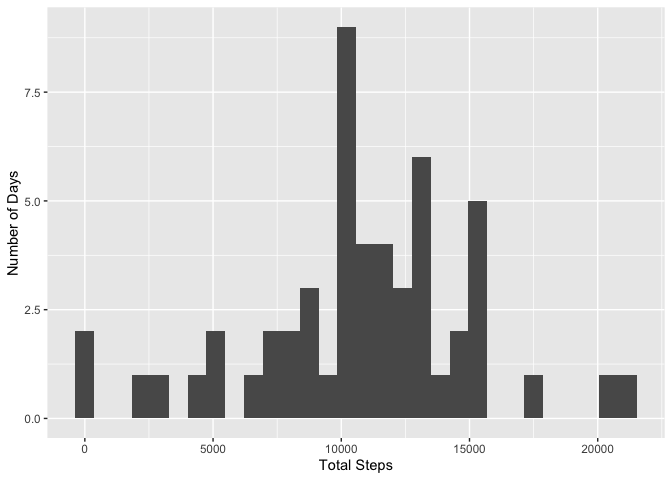
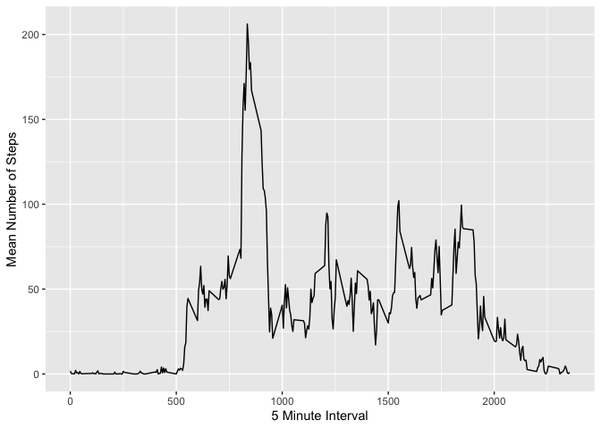
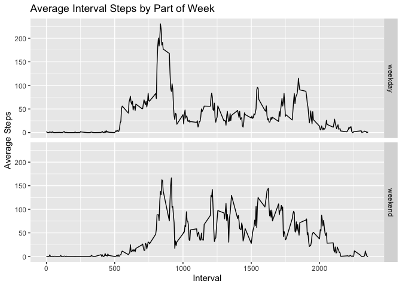

## Loading and preprocessing the data 

```r
fileUrl <- "https://d396qusza40orc.cloudfront.net/repdata%2Fdata%2Factivity.zip"
    zipfileName <- "repdata_data_activity.zip"
    fileName <- "activity.csv"
    if(!file.exists(fileName)){
        download.file(fileUrl, destfile = zipfileName, method="curl")
        unzip(zipfile = zipfileName, files = fileName)
    }
    
activity <- read.csv(
    file = fileName,
    stringsAsFactors = FALSE
) 
head(activity)
```

```
##   steps       date interval
## 1    NA 2012-10-01        0
## 2    NA 2012-10-01        5
## 3    NA 2012-10-01       10
## 4    NA 2012-10-01       15
## 5    NA 2012-10-01       20
## 6    NA 2012-10-01       25
```

## What is mean total number of steps taken per day?

Group the data by date and summarize using sum to get the total steps taken each day:

```r
get_daily_steps <- function(activity_df){
    activity_df %>%
        filter(!is.na(steps)) %>%
        group_by(date) %>%
        summarize(total = sum(steps))
}
daily_steps <- get_daily_steps(activity)
head(daily_steps)
```

```
## # A tibble: 6 x 2
##   date       total
##   <chr>      <int>
## 1 2012-10-02   126
## 2 2012-10-03 11352
## 3 2012-10-04 12116
## 4 2012-10-05 13294
## 5 2012-10-06 15420
## 6 2012-10-07 11015
```
Histogram of the total steps taken each day:


```r
plot_total_steps_hist <- function(activity_df){
    qplot(
        total, 
        data = activity_df, 
        geom="histogram", 
        xlab = "Total Steps", 
        ylab = "Number of Days"
    )
}
plot_total_steps_hist(daily_steps)
```

```
## `stat_bin()` using `bins = 30`. Pick better value with `binwidth`.
```

<!-- -->

Calculate the mean and median steps taken each day:

```r
mean(daily_steps$total)
```

```
## [1] 10766.19
```

```r
median(daily_steps$total)
```

```
## [1] 10765
```

## What is the average daily activity pattern?
Group the data by interval and summarize to get the mean number of steps taken each interval:

```r
interval_steps <- activity %>% 
    filter(!is.na(steps)) %>%
    group_by(interval) %>% 
    summarize(mean=mean(steps))
head(interval_steps)
```

```
## # A tibble: 6 x 2
##   interval   mean
##      <int>  <dbl>
## 1        0 1.72  
## 2        5 0.340 
## 3       10 0.132 
## 4       15 0.151 
## 5       20 0.0755
## 6       25 2.09
```

Time series plot of the 5-minute interval (x-axis) and the average number of steps taken, averaged across all days (y-axis):

```r
qplot(
    interval, 
    mean, 
    data = interval_steps, 
    geom = "line",
    xlab = "5 Minute Interval",
    ylab = "Mean Number of Steps"
)
```

<!-- -->

Calculate the 5-minute interval with the maximum number of average steps:

```r
filter(interval_steps, mean == max(interval_steps$mean))$interval
```

```
## [1] 835
```

## Imputing Missing Values
Note that there are a number of days/intervals where there are missing values (coded as NA). The presence of missing days may introduce bias into some calculations or summaries of the data.

Calculate and report the total number of missing values in the dataset (i.e. the total number of rows with NAs):

```r
activity_na <- filter(activity, is.na(steps))
nrow(activity_na)
```

```
## [1] 2304
```

Replace NA values with the interval's mean number of steps:

```r
get_filled_data <- function(activity_df){
    activity_na_filled <- activity_df %>% 
    group_by(interval) %>% 
    mutate(
        steps = if_else(
            condition = is.na(steps), 
            true = mean(steps, na.rm = TRUE), 
            false = as.double(steps)
        )
    )
}
activity_na_filled <- get_filled_data(activity)
head(activity_na_filled)
```

```
## # A tibble: 6 x 3
## # Groups:   interval [6]
##    steps date       interval
##    <dbl> <chr>         <int>
## 1 1.72   2012-10-01        0
## 2 0.340  2012-10-01        5
## 3 0.132  2012-10-01       10
## 4 0.151  2012-10-01       15
## 5 0.0755 2012-10-01       20
## 6 2.09   2012-10-01       25
```

Group the filled-in data by date and summarize using sum to get the total steps taken each day:

```r
daily_steps_filled_in <- get_daily_steps(activity_na_filled)
```

Histogram of the total steps taken each day with filled-in data:

```r
plot_total_steps_hist(daily_steps_filled_in)
```

```
## `stat_bin()` using `bins = 30`. Pick better value with `binwidth`.
```

<!-- -->

Calculate the mean and median steps taken each day with filled-in data:

```r
mean(daily_steps_filled_in$total)
```

```
## [1] 10766.19
```

```r
median(daily_steps_filled_in$total)
```

```
## [1] 10766.19
```

## Are there differences in activity patterns between weekdays and weekends?

Create a new factor variable in the dataset with two levels -- "weekday" and "weekend" indicating whether a given date is a weekday or weekend day:

```r
weekday_level <- activity_na_filled %>% 
    mutate(
        part_of_week = if_else(
            weekdays(as.Date(date)) %in% c("Saturday", "Sunday"), 
            "weekend", 
            "weekday"
        )
    ) %>%
    mutate(part_of_week = factor(part_of_week))
```

Make a panel plot containing a time series plot (i.e. type = "l") of the 5-minute interval (x-axis) and the average number of steps taken, averaged across all weekday days or weekend days (y-axis):


```r
interval_steps <- weekday_level %>%
    group_by(interval, part_of_week) %>%
    summarize(mean = mean(steps))
qplot(
    interval, 
    mean, 
    data = interval_steps, 
    geom = "line", 
    facets = part_of_week ~ .,
    main = "Average Interval Steps by Part of Week",
    xlab = "Interval", 
    ylab = "Average Steps"
)
```

<!-- -->
